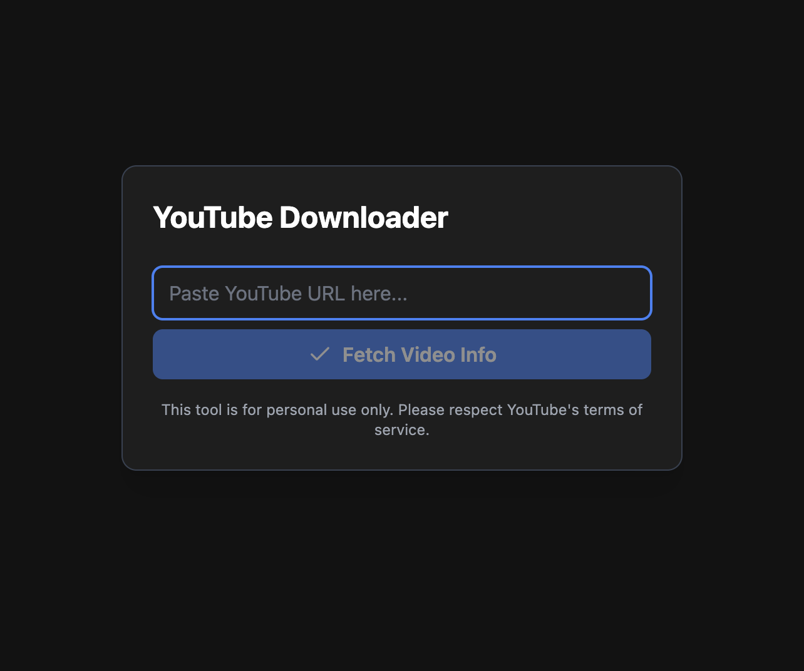

# Youtube Video Downloader
This is a project to help you download youtube videos.
This tool is for personal use only. Please respect YouTube's terms of service.

## Folder structure
#### Back-end
All back-end code is in the `src` folder under the root folder

#### Front-end
All front-end code is in `youtube-downloader` folder under the root folder

## Tech stack
- Front-end: TypeScript + React.js
- Back-end: Python + Flask

## Get started
### Install the backend
1. At the root folder, create a virtual environment
2. Run `python3 -m pip install --upgrade pip` to upgrade pip
3. Run `pip3 install -r requirements.txt` to install all dependencies

### Install the frontend
1. cd into `youtube-downloader` folder
2. Run `npm install` to install all dependencies

## How to use
After installation for back-end and front-end
### Run the back-end
1. cd to the root folder
2. `python3 src/youtube_downloader_APIs.py` to start the backend
### Run the front-end
1. start a new terminal
2. cd into youtube-downloader folder
3. `npm run dev` and then go to the url printed in the terminal

### How to use the cli
Simply run `python3 src/youtube_downloader_cli.py` and follow the instruction to processed.

---
### If you like it
- Give my a thumbs up
- Send me a cup of coffee using the sponsor button on top of the page

